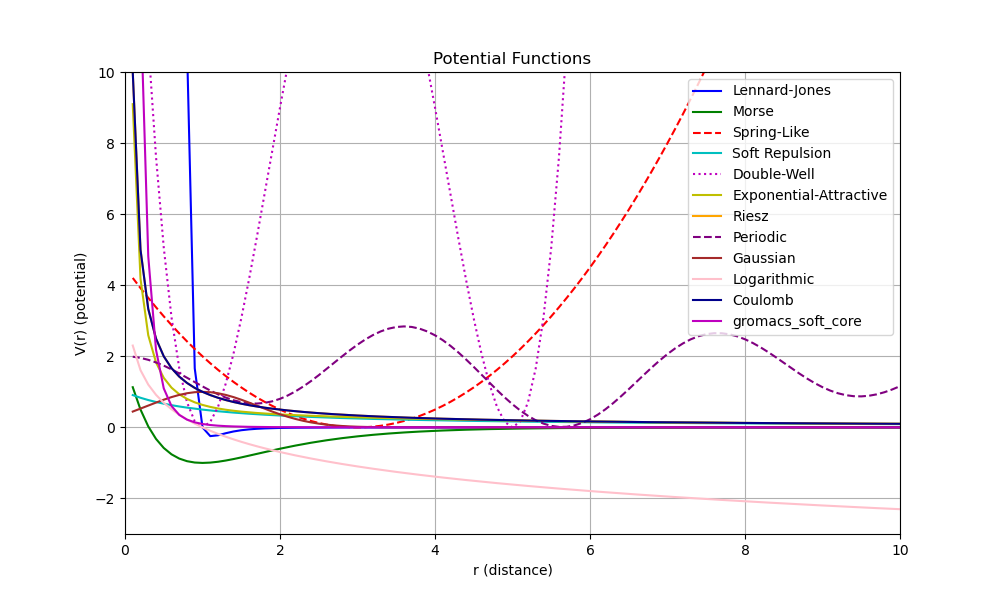

# Survey of Potential Functions for Multi-agent Systems

This project draws from numerous domains to investigate various potential functions (V) that may be useful for multiagent coordination. We present the gradient of the potential function (F), as it is useful in designing control policies for such applications.


## Potential Function Overview

The following table provides a summary of the potential functions investigated.

| **Potential Function** | **Equation \(V(r)\)** | **Gradient (Force) \( \mathbf{F} = -\nabla V(r) \)** | **Applications** |
|------------------------|-----------------------------|------------------------------------------------------|------------------|
| Lennard-Jones [1] | V(r) = \frac{A}{r^{12}} - \frac{B}{r^6} | \mathbf{F} = \left( \frac{-12A}{r^{13}} + \frac{6B}{r^7} \right) \hat{\mathbf{r}} | Molecular dynamics, lattice formation with equilibrium distances |
| Morse [2] | V(r) = D ( e^{-2\beta(r - r_0)} - 2e^{-\beta(r - r_0)}) | \mathbf{F} = D \beta (2e^{-2\beta(r - r_0)} - e^{-\beta(r - r_0)}) \hat{\mathbf{r}} | Agent clustering, smooth lattice transitions |
| Spring-Like [3] | V(r) = \frac{k}{2}(r - r_0)^2 | \mathbf{F} = -k(r - r_0) \hat{\mathbf{r}} | Elastic systems, uniform grid formations |
| Soft Repulsion [4] | V(r) = \frac{A}{(r^p + \epsilon)^q} | \mathbf{F} = -qA \cdot \frac{p \cdot r^{p-1}}{(r^p + \epsilon)^{q+1}} \hat{\mathbf{r}} | Dense formations, collision-free agent systems |
| Double-Well [5] | V(r) = k(r - r_1)^2(r - r_2)^2 | \mathbf{F} = -2k(r - r_1)(r - r_2) ( (r - r_1) + (r - r_2) ) \hat{\mathbf{r}} | Multi-layered or heterogeneous lattice formations |
| Exponential-Attractive and Polynomial-Repulsive [6] | V(r) = \frac{B}{r^m} - Ce^{-\alpha r} | \mathbf{F} = \left( \frac{-mB}{r^{m+1}} + \alpha Ce^{-\alpha r} \right) \hat{\mathbf{r}} | Adaptive formations |
| Riesz [7] | V(r) = \frac{1}{r^s} | \mathbf{F} = \frac{-s}{r^{s+1}} \hat{\mathbf{r}} | Uniform lattice or homogeneous distribution |
| Periodic [8] | V(x, y) = A \sin^2(kx) + B \sin^2(ky) | \mathbf{F}_x = -2Ak \sin(kx)\cos(kx), \, \mathbf{F}_y = -2Bk \sin(ky)\cos(ky) | Grid alignment|
| Gaussian [9] | V(r) = Ae^{-\alpha (r - r_0)^2} | \mathbf{F} = 2A\alpha(r - r_0)e^{-\alpha (r - r_0)^2} \hat{\mathbf{r}} | Sensing coverage, targeted clustering |
| Logarithmic [10] | V(r) = -A \ln(r) | \mathbf{F} = \frac{A}{r} \hat{\mathbf{r}} | Decentralized spreading, minimum distance constraints |
| Coulomb [11] | V(r) = \frac{A}{r} | \mathbf{F} = \frac{-A}{r^2} \hat{\mathbf{r}} | Charge-like repulsion, decentralized uniformity |
| Custom Weighted [12] | V(r) = W(r)f(r) | \mathbf{F} = -W(r)f'(r) - W'(r)f(r) | Hybrid lattices multi-layered dynamics |

Variables:

- r = \|\mathbf{p}_i - \mathbf{p}_j\|: Distance between two agents \(i\) and \(j\).
- \hat{\mathbf{r}} = \frac{\mathbf{p}_i - \mathbf{p}_j}{r}: Unit vector pointing from agent \(j\) to \(i \).
- A, B, C, D, k, \alpha, \beta, r_0, r_1, r_2, \epsilon, m, p, q, s: Tunable parameters for controlling potential strength, range, and equilibrium distance.
- W(r): A custom weighting function defining application-specific dynamics.

## Results

Results of the investigation are presented below. 




## References

1. [Jones, J. E. (1924)](https://www.jstor.org/stable/94265). On the determination of molecular fields. *Proceedings of the Royal Society of London. Series A, Containing Papers of a Mathematical and Physical Character*, 106(738), 441-462.

2. [Morse, P. M. (1929)](https://journals.aps.org/pr/abstract/10.1103/PhysRev.34.57). Diatomic molecules according to the wave mechanics. II. Vibrational levels. *Physical Review*, 34(1), 57-64.

3. [Murray, R. M., et al. (2007)](https://www.cse.lehigh.edu/~trink/Courses/RoboticsII/reading/murray-li-sastry-94-complete.pdf). *Mathematical Introduction to Robotic Manipulation*. CRC Press.

4. [Gapsys, V., Seeliger, D., and de Groot, B. (2012)](https://pubs.acs.org/doi/10.1021/ct300220p). New Soft-Core Potential Function for Molecular Dynamics Based Alchemical Free Energy Calculations, *Journal of Chemical Theory and Computation*, 8(7).

5. [Valani, R., López,A. (2024)](https://www.sciencedirect.com/science/article/pii/S0960077924008051). Quantum-like behavior of an active particle in a double-well potential. *Chaos, Solitons & Fractals*, Volume 186.

6. [Landkof, N. S. (1972)](https://link.springer.com/book/9783642651854). *Foundations of Modern Potential Theory*. Springer-Verlag.

7. [Landkof, N. S. (1972)](https://link.springer.com/book/9783642651854). *Foundations of Modern Potential Theory*. Springer-Verlag.

8. [Landau, L.m, Akhiezer, A., Lifshitz, E. (1967)](https://www.sciencedirect.com/science/article/abs/pii/B9780080091068500091?via%3Dihub). Chapter IV - The Theory of Symmetry. *General Physics*, Pergamon, 1967, Pages 115-143.

9. [Landkof, N. S. (1972)](https://link.springer.com/book/9783642651854). *Foundations of Modern Potential Theory*. Springer-Verlag.

10. [Shakura, N. and Lipunova, G. (2018)](https://academic.oup.com/mnras/article/480/3/4273/5068187). Logarithmic potential for the gravitational field of Schwarzschild black holes. *Monthly Notices of the Royal Astronomical Society*, Volume 480, Issue 3, Pages 4273–4277.

11. [Armour,E., Richard, J., and Varga, K. (2005)](https://www.sciencedirect.com/science/article/abs/pii/S0370157305000943)). Stability of few-charge systems in quantum mechanics. *Physics Reports*, Volume 413, Issue 1.
Pages 1-90.

12. [Wang, S., Zhang, B., Yuan, Y., & Liu, Z. (2023)](https://www.tandfonline.com/doi/full/10.1080/00051144.2023.2231713). A dynamic weight multi-objective model predictive controller for adaptive cruise control system. *Automatika*, 64(4), 919–932.
